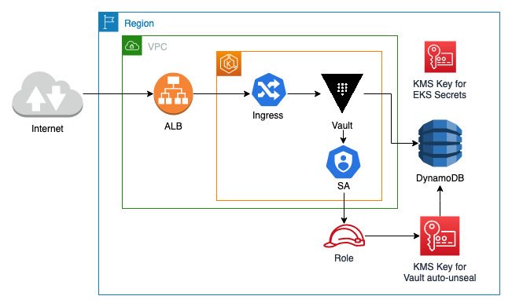
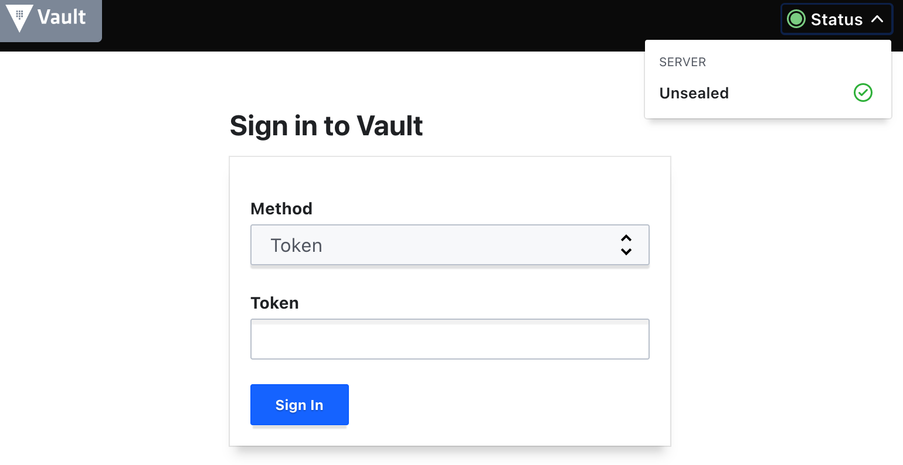

# HashiCorp Vault Add-on for AWS EKS with DynamoDB backend and KMS auto-unseal

> Get started with this add-on by reviewing the following example.
## Table of Contents

- [HashiCorp Vault Add-on for AWS EKS with DynamoDB backend and KMS auto-unseal](#hashicorp-vault-add-on-for-aws-eks-with-dynamodb-backend-and-kms-auto-unseal)
  - [Table of Contents](#table-of-contents)
  - [Overview](#overview)
  - [Usage](#usage)
  - [Variables and Outputs](#variables-and-outputs)

## Overview

The code in this directory showcases an example with the HashiCorp Vault Add-on for AWS EKS using an ecrypted DynamoDB table for storage, KMS auto-unseal, and AWS application load balancer for accessing the UI as depicted on the diagram below.



* [main.tf](./main.tf) contains the AWS and Kubernetes resources needed to use this add-on.
* [outputs.tf](./outputs.tf) defines outputs that make interacting with `kubectl` easier
* [terraform.tf](./terraform.tf) defines the required Terraform (core) and Terraform provider versions
* [variables.tf](./variables.tf) defines the variables needed to use this add-on.

## Usage

Initialize the root module and any associated configuration for providers and child modules by executing the `terraform init` command.

Once all dependencies have been installed, execute `terraform plan` and review the resources that will be created.

If you are satisfied with the proposed settings, execute `terraform apply` to create the resources and deploy HashiCorp Vault to an EKS Cluster.

For more detailed information, see the documentation for the [Terraform Core workflow](https://www.terraform.io/intro/core-workflow).

On successful completion, Terraform will display outputs to configure `kubectl` access.
```sh
Outputs:

configure_kubectl = "aws eks --region us-east-1 update-kubeconfig --name auto-unseal"
eks_cluster_id = "auto-unseal"
vault_ui_url = "k8s-autounseal-d0adfc0cee-2023401821.us-east-1.elb.amazonaws.com"
```

Once `kubectl` is configured, check if the Vault pods are up and running.
```sh
kubectl -n vault get pods
NAME                                   READY   STATUS    RESTARTS   AGE
vault-0                                1/1     Running   0          10m
vault-1                                1/1     Running   0          10m
vault-agent-injector-8db8749c7-smkwp   1/1     Running   0          10m
```

### Initializing Vault
```sh
kubectl exec -it vault-0 -n vault -- vault operator init
Recovery Key 1: +1LRZi0Wvy/DmIrowtgadT3czEN0KFP54vedJuZPBbg+
Recovery Key 2: sb1mf5moTm8zjFqUCXjOjXXnjma4orOl8j1YggQTs/SD
Recovery Key 3: /i9ApIYrf18ItPP8lc3aoAtKJTOATno3TXuozynwlcQW
Recovery Key 4: VXRf7EmraImgWxxzOQb4J+LXe0TXxV56Y3kk359krKH4
Recovery Key 5: hLimP4W4xizV4NivjWpgjGZ3oBJP5KoCDzz+2Kms731H

Initial Root Token: hvs.8L9XO2tTtz6ffwRvROWB0I06

Success! Vault is initialized

Recovery key initialized with 5 key shares and a key threshold of 3. Please
securely distribute the key shares printed above.
```
Make sure to grab the Root Token and store it in a safe place.

Navigate to the Vault URL shown in terraform outputs above `vault_ui_url`. Check the status showing as `Unsealed` at the top right corner and use the root token to log in.



### Cleaning up
```sh
./destroy.sh
```

## Variables and Outputs

The `variables` and `outputs` used within this showcase are _not_ required to be set in this exact way. They are made available merely as an example.

<!-- BEGIN_TF_DOCS -->
## Requirements

| Name | Version |
|------|---------|
| <a name="requirement_terraform"></a> [terraform](#requirement\_terraform) | >= 1.0 |
| <a name="requirement_aws"></a> [aws](#requirement\_aws) | >= 4.45.0 |
| <a name="requirement_helm"></a> [helm](#requirement\_helm) | >= 2.7.1 |
| <a name="requirement_kubernetes"></a> [kubernetes](#requirement\_kubernetes) | >= 2.16.1 |

## Providers

| Name | Version |
|------|---------|
| <a name="provider_aws"></a> [aws](#provider\_aws) | 4.45.0 |
| <a name="provider_kubernetes"></a> [kubernetes](#provider\_kubernetes) | 2.16.1 |

## Modules

| Name | Source | Version |
|------|--------|---------|
| <a name="module_eks_blueprints"></a> [eks\_blueprints](#module\_eks\_blueprints) | github.com/aws-ia/terraform-aws-eks-blueprints | n/a |
| <a name="module_eks_blueprints_kubernetes_addons"></a> [eks\_blueprints\_kubernetes\_addons](#module\_eks\_blueprints\_kubernetes\_addons) | github.com/aws-ia/terraform-aws-eks-blueprints//modules/kubernetes-addons | n/a |
| <a name="module_irsa"></a> [irsa](#module\_irsa) | github.com/aws-ia/terraform-aws-eks-blueprints/modules/irsa | n/a |
| <a name="module_vpc"></a> [vpc](#module\_vpc) | terraform-aws-modules/vpc/aws | ~> 3.0 |

## Resources

| Name | Type |
|------|------|
| [aws_dynamodb_table.this](https://registry.terraform.io/providers/hashicorp/aws/latest/docs/resources/dynamodb_table) | resource |
| [aws_iam_policy.this](https://registry.terraform.io/providers/hashicorp/aws/latest/docs/resources/iam_policy) | resource |
| [aws_kms_alias.backend](https://registry.terraform.io/providers/hashicorp/aws/latest/docs/resources/kms_alias) | resource |
| [aws_kms_alias.this](https://registry.terraform.io/providers/hashicorp/aws/latest/docs/resources/kms_alias) | resource |
| [aws_kms_key.backend](https://registry.terraform.io/providers/hashicorp/aws/latest/docs/resources/kms_key) | resource |
| [aws_kms_key.this](https://registry.terraform.io/providers/hashicorp/aws/latest/docs/resources/kms_key) | resource |
| [kubernetes_ingress_v1.vault](https://registry.terraform.io/providers/hashicorp/kubernetes/latest/docs/resources/ingress_v1) | resource |
| [aws_availability_zones.available](https://registry.terraform.io/providers/hashicorp/aws/latest/docs/data-sources/availability_zones) | data source |
| [aws_caller_identity.current](https://registry.terraform.io/providers/hashicorp/aws/latest/docs/data-sources/caller_identity) | data source |
| [aws_eks_cluster_auth.this](https://registry.terraform.io/providers/hashicorp/aws/latest/docs/data-sources/eks_cluster_auth) | data source |
| [aws_iam_policy_document.kms](https://registry.terraform.io/providers/hashicorp/aws/latest/docs/data-sources/iam_policy_document) | data source |
| [aws_iam_policy_document.this](https://registry.terraform.io/providers/hashicorp/aws/latest/docs/data-sources/iam_policy_document) | data source |

## Inputs

| Name | Description | Type | Default | Required |
|------|-------------|------|---------|:--------:|
| <a name="input_cluster_version"></a> [cluster\_version](#input\_cluster\_version) | Kubernetes version to use for EKS Cluster | `string` | `"1.24"` | no |
| <a name="input_name"></a> [name](#input\_name) | Generic name variable to use for EKS Cluster and resources | `string` | `"auto-unseal"` | no |
| <a name="input_region"></a> [region](#input\_region) | AWS region | `string` | `"us-east-2"` | no |
| <a name="input_vpc_cidr"></a> [vpc\_cidr](#input\_vpc\_cidr) | VPC CIDR | `string` | `"10.0.0.0/16"` | no |

## Outputs

| Name | Description |
|------|-------------|
| <a name="output_configure_kubectl"></a> [configure\_kubectl](#output\_configure\_kubectl) | Configure kubectl: make sure you're logged in with the correct AWS profile and run the following command to update your kubeconfig |
| <a name="output_eks_cluster_id"></a> [eks\_cluster\_id](#output\_eks\_cluster\_id) | Kubernetes Cluster Name |
| <a name="output_vault_ui_hostname"></a> [vault\_ui\_hostname](#output\_vault\_ui\_hostname) | Vault UI can be reached by using the alb hostname |
<!-- END_TF_DOCS -->
